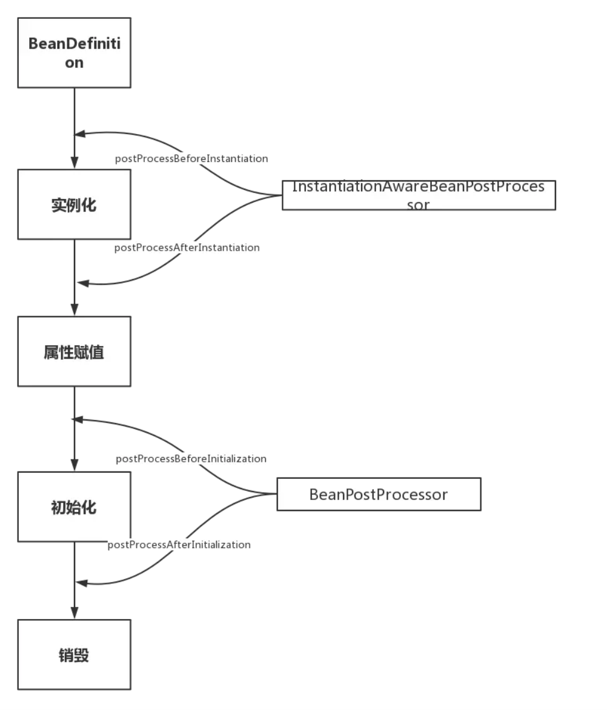

# _**Spring Bean的生命周期**_

## Description
>Spring Bean的生命周期有这四个阶段     
实例化 Instantiation   
属性赋值 Populate   
初始化 Initialization  
销毁 Destruction  
实例化 -> 属性赋值 -> 初始化 -> 销毁

     


## 一、影响多个Bean的接口
### InstantiationAwareBeanPostProcessor
```
InstantiationAwareBeanPostProcessor作用于实例化阶段的前后
InstantiationAwareBeanPostProcessor实际上继承了BeanPostProcessor接口，严格意义上来看他们不是两兄弟，而是两父子。
但是从生命周期角度我们重点关注其特有的对实例化阶段的影响，图中省略了从BeanPostProcessor继承的方法。
    InstantiationAwareBeanPostProcessor extends BeanPostProcessor
    
```
```
InstantiationAwareBeanPostProcessor源码分析：
@Override
protected Object createBean(String beanName, RootBeanDefinition mbd, @Nullable Object[] args)
        throws BeanCreationException {

    try {
        // Give BeanPostProcessors a chance to return a proxy instead of the target bean instance.
        // postProcessBeforeInstantiation方法调用点，这里就不跟进了，
        // 有兴趣的同学可以自己看下，就是for循环调用所有的InstantiationAwareBeanPostProcessor
        Object bean = resolveBeforeInstantiation(beanName, mbdToUse);
        if (bean != null) {
            return bean;
        }
    }
    
    try {   
        // 上文提到的doCreateBean方法，可以看到
        // postProcessBeforeInstantiation方法在创建Bean之前调用
        Object beanInstance = doCreateBean(beanName, mbdToUse, args);
        if (logger.isTraceEnabled()) {
            logger.trace("Finished creating instance of bean '" + beanName + "'");
        }
        return beanInstance;
    }
    
}

```
```
postProcessAfterInstantiation调用点，忽略无关代码：
protected void populateBean(String beanName, RootBeanDefinition mbd, @Nullable BeanWrapper bw) {

   // Give any InstantiationAwareBeanPostProcessors the opportunity to modify the
   // state of the bean before properties are set. This can be used, for example,
   // to support styles of field injection.
   boolean continueWithPropertyPopulation = true;
   
    // InstantiationAwareBeanPostProcessor#postProcessAfterInstantiation()
    // 方法作为属性赋值的前置检查条件，在属性赋值之前执行，能够影响是否进行属性赋值！
   if (!mbd.isSynthetic() && hasInstantiationAwareBeanPostProcessors()) {
      for (BeanPostProcessor bp : getBeanPostProcessors()) {
         if (bp instanceof InstantiationAwareBeanPostProcessor) {
            InstantiationAwareBeanPostProcessor ibp = (InstantiationAwareBeanPostProcessor) bp;
            if (!ibp.postProcessAfterInstantiation(bw.getWrappedInstance(), beanName)) {
               continueWithPropertyPopulation = false;
               break;
            }
         }
      }
   }

   // 忽略后续的属性赋值操作代码
}
```
### BeanPostProcessor
```
BeanPostProcessor作用于初始化阶段的前后
BeanPostProcessor接口包括2个方法postProcessAfterInitialization和postProcessBeforeInitialization，这两个方法的第一个参数都是要处理的Bean对象，第二个参数都是Bean的name
```
BeanPostProcessor 注册时机与执行顺序
```
注册时机
我们知道BeanPostProcessor也会注册为Bean，那么Spring是如何保证BeanPostProcessor在我们的业务Bean之前初始化完成呢？
@Override
public void refresh() throws BeansException, IllegalStateException {
    synchronized (this.startupShutdownMonitor) {

        try {
            // Allows post-processing of the bean factory in context subclasses.
            postProcessBeanFactory(beanFactory);

            // Invoke factory processors registered as beans in the context.
            invokeBeanFactoryPostProcessors(beanFactory);

            // Register bean processors that intercept bean creation.
            // 所有BeanPostProcesser初始化的调用点
            registerBeanPostProcessors(beanFactory);

            // Initialize message source for this context.
            initMessageSource();

            // Initialize event multicaster for this context.
            initApplicationEventMulticaster();

            // Initialize other special beans in specific context subclasses.
            onRefresh();

            // Check for listener beans and register them.
            registerListeners();

            // Instantiate all remaining (non-lazy-init) singletons.
            // 所有单例非懒加载Bean的调用点
            finishBeanFactoryInitialization(beanFactory);

            // Last step: publish corresponding event.
            finishRefresh();
        }
    }
}
可以看出，Spring是先执行registerBeanPostProcessors()进行BeanPostProcessors的注册，然后再执行finishBeanFactoryInitialization初始化我们的单例非懒加载的Bean。
```
```
执行顺序
BeanPostProcessor有很多个，而且每个BeanPostProcessor都影响多个Bean，其执行顺序至关重要，必须能够控制其执行顺序才行。关于执行顺序这里需要引入两个排序相关的接口：PriorityOrdered、Ordered

1. PriorityOrdered是一等公民，首先被执行，PriorityOrdered公民之间通过接口返回值排序

2. Ordered是二等公民，然后执行，Ordered公民之间通过接口返回值排序

3. 都没有实现是三等公民，最后执行

// First, invoke the BeanDefinitionRegistryPostProcessors that implement PriorityOrdered.
// 首先，加入实现了PriorityOrdered接口的BeanPostProcessors，顺便根据PriorityOrdered排了序
String[] postProcessorNames =
        beanFactory.getBeanNamesForType(BeanDefinitionRegistryPostProcessor.class, true, false);
for (String ppName : postProcessorNames) {
    if (beanFactory.isTypeMatch(ppName, PriorityOrdered.class)) {
        currentRegistryProcessors.add(beanFactory.getBean(ppName, BeanDefinitionRegistryPostProcessor.class));
        processedBeans.add(ppName);
    }
}
sortPostProcessors(currentRegistryProcessors, beanFactory);
registryProcessors.addAll(currentRegistryProcessors);
invokeBeanDefinitionRegistryPostProcessors(currentRegistryProcessors, registry);
currentRegistryProcessors.clear();

// Next, invoke the BeanDefinitionRegistryPostProcessors that implement Ordered.
// 然后，加入实现了Ordered接口的BeanPostProcessors，顺便根据Ordered排了序
postProcessorNames = beanFactory.getBeanNamesForType(BeanDefinitionRegistryPostProcessor.class, true, false);
for (String ppName : postProcessorNames) {
    if (!processedBeans.contains(ppName) && beanFactory.isTypeMatch(ppName, Ordered.class)) {
        currentRegistryProcessors.add(beanFactory.getBean(ppName, BeanDefinitionRegistryPostProcessor.class));
        processedBeans.add(ppName);
    }
}
sortPostProcessors(currentRegistryProcessors, beanFactory);
registryProcessors.addAll(currentRegistryProcessors);
invokeBeanDefinitionRegistryPostProcessors(currentRegistryProcessors, registry);
currentRegistryProcessors.clear();

// Finally, invoke all other BeanDefinitionRegistryPostProcessors until no further ones appear.
// 最后加入其他常规的BeanPostProcessors
boolean reiterate = true;
while (reiterate) {
    reiterate = false;
    postProcessorNames = beanFactory.getBeanNamesForType(BeanDefinitionRegistryPostProcessor.class, true, false);
    for (String ppName : postProcessorNames) {
        if (!processedBeans.contains(ppName)) {
            currentRegistryProcessors.add(beanFactory.getBean(ppName, BeanDefinitionRegistryPostProcessor.class));
            processedBeans.add(ppName);
            reiterate = true;
        }
    }
    sortPostProcessors(currentRegistryProcessors, beanFactory);
    registryProcessors.addAll(currentRegistryProcessors);
    invokeBeanDefinitionRegistryPostProcessors(currentRegistryProcessors, registry);
    currentRegistryProcessors.clear();
}


根据排序接口返回值排序，默认升序排序，返回值越低优先级越高。
/**
 * Useful constant for the highest precedence value.
 * @see java.lang.Integer#MIN_VALUE
 */
int HIGHEST_PRECEDENCE = Integer.MIN_VALUE;

/**
 * Useful constant for the lowest precedence value.
 * @see java.lang.Integer#MAX_VALUE
 */
int LOWEST_PRECEDENCE = Integer.MAX_VALUE;
PriorityOrdered、Ordered接口作为Spring整个框架通用的排序接口，在Spring中应用广泛，也是非常重要的接口。
```

## 二、只调用一次的接口
### Aware类型的接口
```
Aware类型的接口的作用就是让我们能够拿到Spring容器中的一些资源。
基本都能够见名知意，Aware之前的名字就是可以拿到什么资源，例如BeanNameAware可以拿到BeanName，以此类推。
调用时机需要注意：所有的Aware方法都是在初始化阶段之前调用的！

Aware Group1
1. BeanNameAware
2. BeanClassLoaderAware
3. BeanFactoryAware

Aware Group2
1. EnvironmentAware
2. EmbeddedValueResolverAware 这个知道的人可能不多，实现该接口能够获取Spring EL解析器，用户的自定义注解需要支持spel表达式的时候可以使用，非常方便。
3. ApplicationContextAware(ResourceLoaderAware\ApplicationEventPublisherAware\MessageSourceAware) 这几个接口可能让人有点懵，实际上这几个接口可以一起记，其返回值实质上都是当前的ApplicationContext对象，因为ApplicationContext是一个复合接口，如下：

这里涉及到另一道面试题，ApplicationContext和BeanFactory的区别，可以从ApplicationContext继承的这几个接口入手，除去BeanFactory相关的两个接口就是ApplicationContext独有的功能，这里不详细说明。
```
Aware调用时机源码分析

```
 // 见名知意，初始化阶段调用的方法
protected Object initializeBean(final String beanName, final Object bean, @Nullable RootBeanDefinition mbd) {

    // 这里调用的是Group1中的三个Bean开头的Aware
    invokeAwareMethods(beanName, bean);

    Object wrappedBean = bean;
    
    // 这里调用的是Group2中的几个Aware，
    // 而实质上这里就是前面所说的BeanPostProcessor的调用点！
    // 也就是说与Group1中的Aware不同，这里是通过BeanPostProcessor（ApplicationContextAwareProcessor）实现的。
    wrappedBean = applyBeanPostProcessorsBeforeInitialization(wrappedBean, beanName);
    // 下文即将介绍的InitializingBean调用点
    invokeInitMethods(beanName, wrappedBean, mbd);
    // BeanPostProcessor的另一个调用点
    wrappedBean = applyBeanPostProcessorsAfterInitialization(wrappedBean, beanName);

    return wrappedBean;
}
```

### 命周期接口
```
1. InitializingBean 对应生命周期的初始化阶段，在上面源码的invokeInitMethods(beanName, wrappedBean, mbd)
    有一点需要注意，因为Aware方法都是执行在初始化方法之前，所以可以在初始化方法中放心大胆的使用Aware接口获取的资源，这也是我们自定义扩展Spring的常用方式。
    除了实现InitializingBean接口之外还能通过注解或者xml配置的方式指定初始化方法，至于这几种定义方式的调用顺序其实没有必要记。因为这几个方法对应的都是同一个生命周期，只是实现方式不同，我们一般只采用其中一种方式。

2. DisposableBean 类似于InitializingBean，对应生命周期的销毁阶段，以ConfigurableApplicationContext#close()方法作为入口，实现是通过循环取所有实现了DisposableBean接口的Bean然后调用其destroy()方法。
```


## Relative Link
- [请别再问Spring Bean的生命周期了！](https://www.jianshu.com/p/1dec08d290c1)
- [Spring Bean的生命周期（非常详细）](https://www.cnblogs.com/zrtqsk/p/3735273.html)
#
