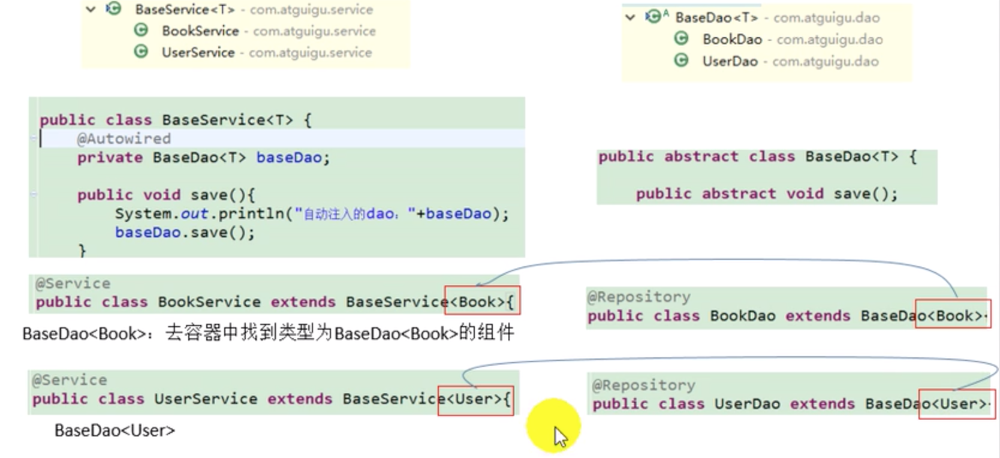

# _**Spring 泛型依赖注入原理**_

## Description
>由于java的擦除机制，泛型T只在编译期有效，在运行期会被擦除，所以我们在运行期不能直接获得T的类，一些对一般类有效的方法，
比如T.class和t.getClass()对泛型都是非法的。因此我们需要通过反射机制获取T的类。

```
public void printType() {
    Type genericSuperclass = this.getClass().getGenericSuperclass();
    Class<T> entityClass = (Class<T>) ((ParameterizedType) genericSuperclass).getActualTypeArguments()[0];
    System.out.println(entityClass);
}
这段代码第一行的作用是获取当前类的父类.    
第二行中通过查看父类的类参数获得当前类泛型的类。    
也就是说，这是一个通过父类的参数来查看子类中泛型的具体类型的方法。
因此，这个方法有一些使用上的要求：首先，这个方法必须被带泛型类的子类所使用，带泛型类本身是不能使用这个方法的。
另外，这个子类在泛型的位置必须继承一个具体的类，而不是泛型T。
举个例子，当有一个类继承BaseBaen<A>时，这个方法就可以使用，而继承BaseBean<T>的时候就不能使用，
因为A是具体的类，而T是泛型，在运行期就算我们从父类中取到了T，因为有擦除机制，我们仍然无法得知T是一个什么类。
```



## Relative Link
- [Spring 泛型依赖注入](https://blog.csdn.net/qq_36761831/article/details/88133065)
