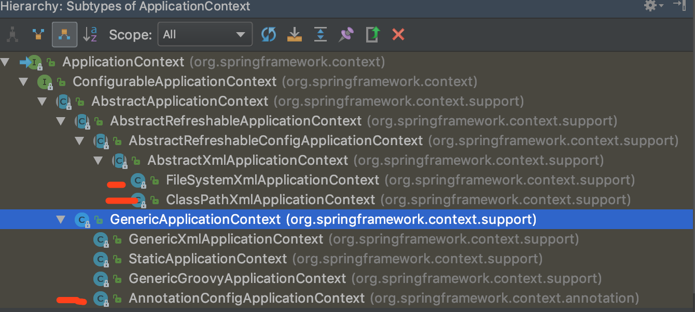
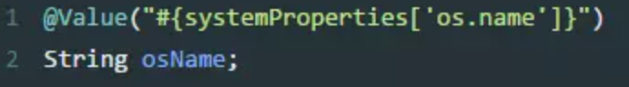
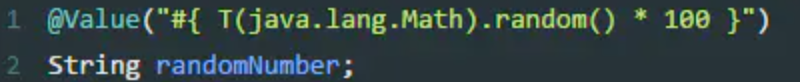
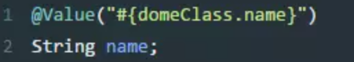
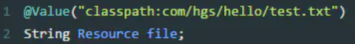
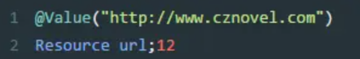
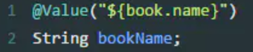

# _**Spring Framework 核心容器**_

## Description
>Spring Framework的核心文件包, 也就是maven中要导入的包源    
spring-beans   
spring-context  
spring-core     
spring-expression


## 读取配置文件
```
从容器中拿到组件
ApplicationContext:代表容器
src文件是源码包, 它也是程序执行的根路径,一般在bin(java 程序)文件或者webapp/项目名(web程序)下
resource是资源包, 编译后一般包内的内容会直接编译到src同级别的文件下面。所以我们直接引用文件名就能找到configuration的文件因为它就在根路径下

1. 读取xml文件方式
    从当前应用文件内读取
    ApplicationContext ioc = new ClassPathXmlApplicationContext("spring.xml");
    
    从操作系统内部直接读取
    ApplicationContext ioc = new FileSystemXmlApplicationContext("/Users/Stoic_Colony/Documents/GitHub/SpringCore/SpringIOC/src/main/resources/spring.xml");

2. 使用注解
    1. xml 开启注解
        <context:component-scan base-package="com.web"/>


```



## SPRING通过XML创建对象方式和为不同类型的属性赋值的几种方式
### 一、IOC创建对象的三种方式
```
1、使用无参构造器，也是默认的创建方式

2、使用有参构造器
    1) 第一种：下标赋值 :  <constructor-arg index="0" value="zhangsan"/>
    2) 第二种：类型赋值:  <constructor-arg type="java.lang.String" value="zhangsan"/>  不能处理两个参数类型一样的情况
    3) 第三种：直接通过参数名赋值 <constructor-arg name="name" value="zhangsan"/>

3、利用工厂创建对象　　　
    静态工厂：工厂本身不需要创建对象；通过静态方法调用，对象=工厂类.工厂方法名();
        使用方法：
            class: 指定工厂全类名
            factory-method: 指定工厂方法
            constructor-arg: 可以为方法传参
　　　　　　　　<bean id="airPlane01" class="com.lxy.factory.AirPlaneStaticFactory" factory-method="getAirPlane">
　　　　　　　　　　<constructor-arg name="name" value="波音747"/>
　　　　　　　　</bean>

    实例工厂：工厂本身需要创建对象
        工厂类 工厂对象 = new 工厂类();
        工厂对象.工厂方法名();
        区别就是 一个是静态的方法 一个不是 静态方法可以直接调用，不是静态需要先new　　
        使用方法　　　　　　
            1、先配置出实例工厂对象  <bean id="airPlaneInstaceFactory" class="com.lxy.factory.AirPlaneInstanceFactory"/>
            2、配置我们要创建的AirPlane使用哪个工厂创建
                1)、factory-bean指定使用哪个工厂创建
                2)、factory-method指定使用哪个工厂方法　　　
                <bean id="airPlane02" class="com.lxy.pojo.AirPlane" factory-bean="airPlaneInstaceFactory" factory-method="getAirPlane">
　　　　　　　　　　　　<constructor-arg name="name" value="波音787"/>
　　　　　　　　　　</bean>
        实现了FactoryBean的接口类是Spring可以认识的工厂类  自己写的工厂类需要继承FactoryBean
            Spring会自动的调用工厂方法创建实例
                1、编写一个FactoryBean的实现类
                2、在Spring配置文件中进行注册
                <bean id="myFactoryBeanImpl" class="com.lxy.factory.MyFactoryBeanImpl"/>
```
### 二、不同类型的赋值/注入方式
```
1、普通赋值
    <bean id="hello" class="com.lxy.pojo.Hello">
        <property name="str" value="Spring"/> 通过value
    </bean>

2、对象赋值
    <bean id="userServiceImpl" class="com.lxy.service.UserServiceImpl">
        <property name="userDao" ref="mysqlImpl"/>  通过ref
    <bean/>

3、bean注入 (以下<bean id=""><bean>等省略，只写了注入方式)
    <property name="address" ref="hello"/>

4、数组注入　
    <property name="books">
        <array>
            <value>西游记</value>
            <value>红楼梦</value>
            <value>三国演义</value>
            <value>水浒传</value>
        </array>
    </property>

5、list 注入（set同理  只是把标签换成<set>）
    1) list中添加普通值
    <property name="hobbies">
        <list>
            <value>敲代码</value>
            <value>听音乐</value>
            <value>打台球</value>
        </list>
    </property>

　　2) list中添加对象 （所有其他容器类型都可以通过这种方式进行对象添加）
    <property name="bookList">
        <list>
            <bean id="book01" class="com.lxy.pojo.Book" p:bookName="三体"/>
            <ref bean="book01"/>
        </list>
    </property>

6、map注入 
    1）不可引用注入　　　　
        <property name="card">
            <map>
                <entry key="1" value="身份证"/>
                <entry key="2" value="校园卡"/>
                <entry key="3" value="医保卡"/>
            </map>
        </property>
        
    2）可以引用注入（list、set也可以通过这种方式进行可以引用注入）　　　　
        <util:map id="map">
            <entry key="1" value="元素1"/>
            <entry key="2" value="元素2"/>
            <entry key="3" value="元素3"/>
        </util:map>

7、null注入（主要用在想把某个已经赋值的属性再赋值为null）
    <property name="wife">
        <null/>
    </property>

8、properties注入　
    <property name="info">
        <props>
            <prop key="学号">1111</prop>
            <prop key="姓名">张三</prop>
        </props>
    </property>

9、继承<bean>的配置信息（如果一个<bean>设置有abstract=true 那么这个bean只能被继承，不能实例化）
    <bean id="book02" class="com.lxy.pojo.Book" parent="book01" >
        <property name="price" value="100"/>
    </bean>
```

### 三、通过命名空间注入值  （c命名空间和p命名空间不能直接使用，需要导入xml约束）
```
1)、p命名空间注入，可以直接注入属性的值: property
    singleton: 单例模式（spring默认机制）
    1、在容器启动完成之前就已经创建好对象，保存在容器中
    2、任何获取都是获取之前创建好的对象
    
    导入p命名空间 xmlns:p="http://www.springframework.org/schema/p"
    bean id="user" class="com.lxy.pojo.User" p:name="张三" p:age="24" scope="singleton"　

2)、c命名空间注入，通过构造器注入: constructor-args
    prototype: 原型模式：每次从容器中get的时候，都会产生一个新的对象
    1、容器启动默认不会去创建多实例bean　　
    2、获取的时候创建bean
    3、每次获取都会创建一个新的实例对象
    
    导入p命名空间 xmlns:p="http://www.springframework.org/schema/c"
    <bean id="user2" class="com.lxy.pojo.User" c:age="24" c:name="李四" scope="prototype"/>
```

### 四、通过SpEL（Spring Expression Language）赋值　　
```
<bean id="student" class="com.lxy.pojo.Student">
    <property name="name" value="lisi"/>
</bean>
<bean id="book" class="com.lxy.pojo.Book">
    <property name="bookName" value="三体"/>
    <property name="price" value="100"/>
</bean>
　　
<bean id="user" class="com.lxy.pojo.User">
    <!--字面量 #{} 可以在#{}里面直接写运算表达式-->
    <property name="salary" value="#{12345.97*12}"/>
    <!--引用其他bean的某个属性值-->
    <property name="studentName" value="#{student.name}" />
    <!--引用其他bean-->
    <property name="book" value="#{book}"/>
    <!--调用静态方法--> #{T(全类名).方法名}
    <property name="id" value="#{T(java.util.UUID).randomUUID().toString().substring(0,5)}"/>
    <!--调用非静态方法-->
    <property name="age" value="#{book.getPrice()}"/>
</bean>
```

### 五、自动装配
```
自动装配：仅限于对自定义类型的属性有效 前提是容器中必须有相对应的组件
    byName: 会自动在容器上下文中查找，和自己对象set方法后面的值对应的bean id  注意：不能够区分大小写，id都用小写
    byType: 会自动在容器上下文中查找，和自己对象属相同的bean （可以省略id）注意：需要保证类型全局唯一
    constructor: 按照有参构造器进行赋值
        1、先按照有参构造器参数的类型进行装配，没有装配null
        2、如果找到的类型有多个，参数的名作为id继续匹配
    如果属性是一个容器 例如list<book> 那么自动装配会把所有的book的bean装配进去

    <bean id="people" class="com.lxy.pojo.People" autowire="byName">
        <property name="name" value="张三"/>
    </bean>
    
    也可以通过注解的方式 在属性上添加@Autowired
```

## SPRING常用注解

### 1、声明bean的注解
```
@Component 组件，没有明确的角色
@Service 在业务逻辑层使用（service层）
@Repository 在数据访问层使用（dao层）
@Controller 在展现层使用，控制器的声明（C）
他们本质上并没有区别, 但是如果正确标识的化可以方便以后Spring IOC容器的扫描和过滤
```
### 2、注入bean的注解
```
@Autowired：由Spring提供 与之配套的是Qualifier 是作用于多个匹配结果的情况下Qulifier可以进一步过滤
@Inject：由JSR-330提供
@Resource：由JSR-250提供
tip: 
    Autowired原理: 
        1.先按类型去容器中寻找对应的组件
            a.找到就会直接赋值
            b.没找到就抛出异常
            c.找到多个
                1.按变量名作为id进行匹配
                2.如果还没匹配上的话就报错
        2.有Qualifer的话, 1就不适用. 直接用Qualifer里的id进行匹配
```

### 3、java配置类相关注解
```
@Configuration 声明当前类为配置类，相当于xml形式的Spring配置（类上）
@Bean 注解在方法上，声明当前方法的返回值为一个bean，替代xml中的方式（方法上）
@ComponentScan 用于对Component进行扫描，相当于xml中的（类上）
@WishlyConfiguration 为@Configuration与@ComponentScan的组合注解，可以替代这两个注解
```

### 4、切面（AOP）相关注解
```
Spring支持AspectJ的注解式切面编程。
@Aspect 声明一个切面（类上）
使用@After、@Before、@Around定义建言（advice），可直接将拦截规则（切点）作为参数。
@After 在方法执行之后执行（方法上）
@Before 在方法执行之前执行（方法上）
@Around 在方法执行之前与之后执行（方法上）
@PointCut 声明切点
```

### 5、@Bean的属性支持
```
@Scope 设置Spring容器如何新建Bean实例（方法上，得有@Bean）
其设置类型包括：
    Singleton （单例,一个Spring容器中只有一个bean实例，默认模式）,
    Protetype （每次调用新建一个bean）,
    Request （web项目中，给每个http request新建一个bean）,
    Session （web项目中，给每个http session新建一个bean）,
    GlobalSession（给每一个 global http session新建一个Bean实例）
@StepScope 在Spring Batch中还有涉及
@PostConstruct 由JSR-250提供，在构造函数执行完之后执行，等价于xml配置文件中bean的initMethod
@PreDestory 由JSR-250提供，在Bean销毁之前执行，等价于xml配置文件中bean的destroyMethod
```

### 6、@Value注解
》注入普通字符     
  

》注入操作系统属性   
   

》注入表达式结果    
  

》注入其它bean属性     
    

》注入文件资源     
   

》注入网站资源      
    

》注入配置文件     
    

》@PropertySource 加载配置文件(类上)


### 7、环境切换
```
@Profile 通过设定Environment的ActiveProfiles来设定当前context需要使用的配置环境。（类或方法上）
@Conditional Spring4中可以使用此注解定义条件话的bean，通过实现Condition接口，并重写matches方法，从而决定该bean是否被实例化。（方法上）
```    

### 8、异步相关
```
@EnableAsync 配置类中，通过此注解开启对异步任务的支持，叙事性AsyncConfigurer接口（类上）
@Async 在实际执行的bean方法使用该注解来申明其是一个异步任务（方法上或类上所有的方法都将异步，需要@EnableAsync开启异步任务）
```

### 9、定时任务相关
```
@EnableScheduling 在配置类上使用，开启计划任务的支持（类上）
@Scheduled 来申明这是一个任务，包括cron,fixDelay,fixRate等类型（方法上，需先开启计划任务的支持）
```

### 10、@Enable*注解说明
```
@EnableAspectJAutoProxy 开启对AspectJ自动代理的支持
@EnableAsync 开启异步方法的支持
@EnableScheduling 开启计划任务的支持
@EnableWebMvc 开启Web MVC的配置支持
@EnableConfigurationProperties 开启对@ConfigurationProperties注解配置Bean的支持
@EnableJpaRepositories 开启对SpringData JPA Repository的支持
@EnableTransactionManagement 开启注解式事务的支持
@EnableTransactionManagement 开启注解式事务的支持
@EnableCaching 开启注解式的缓存支持
```

### 11、测试相关注解
```
@RunWith 运行器，Spring中通常用于对JUnit的支持
@ContextConfiguration 用来加载配置ApplicationContext，其中classes属性用来加载配置类
```

### SpringMVC部分
```
@EnableWebMvc 在配置类中开启Web MVC的配置支持，如一些ViewResolver或者MessageConverter等，若无此句，重写WebMvcConfigurerAdapter方法（用于对SpringMVC的配置）。
@Controller 声明该类为SpringMVC中的Controller
@RequestMapping 用于映射Web请求，包括访问路径和参数（类或方法上）
@ResponseBody 支持将返回值放在response内，而不是一个页面，通常用户返回json数据（返回值旁或方法上）
@RequestBody 允许request的参数在request体中，而不是在直接连接在地址后面。（放在参数前）
@PathVariable 用于接收路径参数，比如@RequestMapping(“/hello/{name}”)申明的路径，将注解放在参数中前，即可获取该值，通常作为Restful的接口实现方法。
@RestController 该注解为一个组合注解，相当于@Controller和@ResponseBody的组合，注解在类上，意味着，该Controller的所有方法都默认加上了@ResponseBody。
@ControllerAdvice 通过该注解，我们可以将对于控制器的全局配置放置在同一个位置，注解了@Controller的类的方法可使用@ExceptionHandler、@InitBinder、@ModelAttribute注解到方法上，
    这对所有注解了 @RequestMapping的控制器内的方法有效。
@ExceptionHandler 用于全局处理控制器里的异常
@InitBinder 用来设置WebDataBinder，WebDataBinder用来自动绑定前台请求参数到Model中。
@ModelAttribute 本来的作用是绑定键值对到Model里，在@ControllerAdvice中是让全局的@RequestMapping都能获得在此处设置的键值对。
```


## Relative Link
- [SPRING通过XML创建对象方式和为不同类型的属性赋值的几种方式](https://www.cnblogs.com/lxy-java/p/12817542.html)
- [Java开发者必须掌握的20个Spring常用注解](https://www.jianshu.com/p/71e8971d2bc5?utm_campaign=maleskine&utm_content=note&utm_medium=seo_notes&utm_source=recommendation)
#
